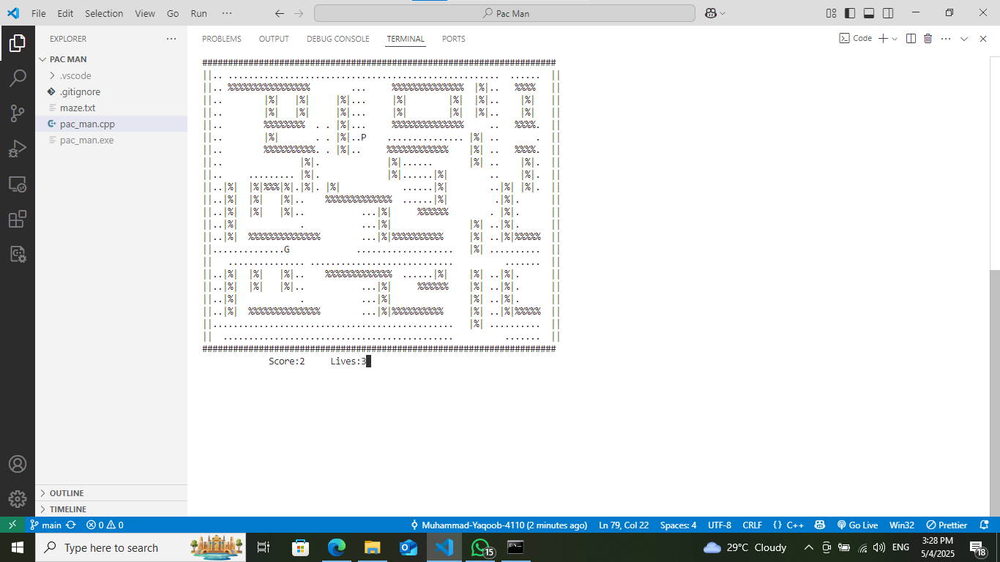

## pac-man
C++ Console based pac-man game.

## Setup
You must have a C++ setup. If you have the setup then just run `pac_man.cpp` file.

## Contributing
Contributions are welcome! To contribute:
- Fork the repository.
- Make your changes.
- Commit and push.
- Create a pull request.

## How It Looks?

## License
This project is licensed under the [MIT License](LICENSE).